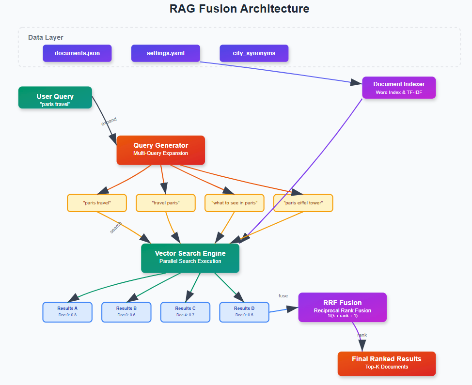

# Master the Art of Multi-Query RAG for Next-Level AI Applications

Unlock the full potential of Retrieval-Augmented Generation (RAG) with advanced multi-query techniques. This repository provides a robust, production-ready framework for building, experimenting, and deploying multi-query RAG pipelines for AI applications.

---

## Table of Contents
- [Overview](#overview)
- [Features](#features)
- [Architecture](#architecture)
- [Installation](#installation)
- [Configuration](#configuration)
- [Usage](#usage)
- [Design Documents](#design-documents)
- [Extending the Framework](#extending-the-framework)
- [Contributing](#contributing)
- [License](#license)

---

## Overview
This project implements a modular and extensible Multi-Query RAG system, enabling AI applications to retrieve and synthesize information from large document collections using multiple, diverse queries. The framework is designed for research, prototyping, and production deployment.

---



---

## Features
- **Multi-Query Generation:** Generate and manage multiple queries per user input to maximize retrieval coverage.
- **Flexible Data Loading:** Easily ingest and preprocess documents from various sources.
- **Fusion Strategies:** Combine results from multiple queries using advanced fusion algorithms.
- **Configurable Pipelines:** YAML/JSON-based configuration for easy customization.
- **Logging and Monitoring:** Built-in logging for debugging and performance tracking.
- **Extensible Modules:** Plug-and-play architecture for custom retrievers, fusers, and query generators.

---

## Architecture

```
User Query
    │
    ▼
[Query Generator] ──► [Retriever(s)] ──► [Fusion Module] ──► [RAG Model] ──► [Response]
```

- **Query Generator:** Expands user input into multiple semantically diverse queries.
- **Retriever:** Fetches relevant documents for each query.
- **Fusion Module:** Merges and ranks retrieved documents.
- **RAG Model:** Synthesizes a final answer using the fused context.

---

## Installation

1. **Clone the repository:**
   ```bash
   git clone https://github.com/your-org/Multi-Query-RAG.git
   cd Master-the-Art-of-Multi-Query-RAG-for-Next-Level-AI-Applications
   ```

2. **Install dependencies:**
   ```bash
   pip install -r requirements.txt
   ```

---

## Configuration

- **Document Sources:** Configure in `config/documents.json`.
- **Pipeline Settings:** Adjust parameters in `config/settings.yaml`.

Example `settings.yaml`:
```yaml
retriever:
  type: "BM25"
  top_k: 10
fusion:
  method: "reciprocal_rank_fusion"
  parameters:
    k: 60
```

---

## Usage

### Run the Main Pipeline

```bash
python main.py --config config/settings.yaml
```

### Example

```python
from multi_query_rag import MultiQueryRAG

rag = MultiQueryRAG(config_path="config/settings.yaml")
response = rag.answer("What are the latest advancements in multi-query RAG?")
print(response)
```

---

## Design Documents

- **GIF Demos:** See `design_docs/record_*.gif` for visual walkthroughs.
- **Technical Specs:** Refer to `design_docs/` for architecture and design notes.

---

## Extending the Framework

- **Add a New Retriever:** Implement in `rag/index.py` or `rag/data_loader.py`.
- **Custom Fusion:** Extend `rag/fusion.py` with new fusion strategies.
- **Logging:** Configure in `rag/logging_config.py`.

---

## Contributing

Contributions are welcome! Please open issues or submit pull requests for new features, bug fixes, or documentation improvements.

---

## License

This project is licensed under the [MIT License](LICENSE).

---

For questions or support, please contact the maintainers or open an issue on GitHub.

